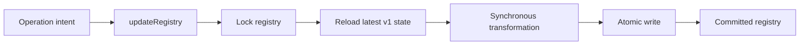

# Registry-owned write freshness

**Feature:** `architecture-003`
**Status:** Completed
**Start branch:** `main` at `0a1b65c`
**PR target:** `main`

## Outcome

Registry persistence now has one freshness-owning write interface. `updateRegistry()` acquires the existing file lock, reloads the latest v1 registry, applies a synchronous state transformation, atomically writes, and returns the committed result. The unlocked whole-snapshot `saveRegistry()` API was removed from source, tests, and the package export surface.

This prevents dashboard, CLI, worktree, and external subagent writers from silently erasing one another's valid rows or fields while preserving the registry format, row ordering, lifecycle ordering, errors, and user-visible behavior.

## Implementation

### Controller mutations

`SessionsController` intent methods now calculate rename, acknowledgement, group order, reorder cohorts, bucket cascades, Pi-name sync, and group rename from the locked latest registry. The controller adopts the committed result and repairs selection within the active filter, clearing and request-invalidating preview state when selection changes. Concurrent deletion remains authoritative and cannot resurrect a captured row.

### Refresh projection

Refresh captures tmux presence, heartbeat, and metadata outside the lock. Each observation retains both session ID and the observed `tmuxSession`; it is applied only when both still identify the latest row. Status is recomputed against the latest row so concurrent acknowledgement and organizational changes survive. Rows added after observation remain untouched.

Missing-subagent and expired-archive pruning is derived from latest rows plus matching observations. Post-commit dashboard cleanup runs only for rows actually removed by the committed mutation.

### Delete and worktree lifecycle

Tmux, workspace, and Git operations remain outside registry locks and retain their established order. Successful deletion filters only the prepared ID set from latest state, preserving unrelated changes and descendants created after preparation.

Partial worktree failure updates the latest surviving parent with `remainingWorktreeSession()` rather than upserting a captured session. A concurrently deleted parent stays deleted.

### Session start

`startManagedSession()` materializes workspace state outside the lock, then confirms the latest row still has the same tmux and workspace identity and remains a parent session. It commits only canonical workspace output fields onto the latest row. Missing, subagent, or reconfigured targets abort before tmux creation with a retryable error.

A narrow optional workspace-materializer parameter provides deterministic concurrency testing without introducing a general dependency container.

## Architecture rules

- `loadRegistry()` is read-only; `updateRegistry()` is the only registry write path.
- Registry callbacks are short, synchronous, and state-only.
- Pass operation intent or completed external results into callbacks, never a captured whole-registry replacement.
- Never hold the registry lock across tmux, filesystem, heartbeat, metadata, workspace, theme, or Git work.
- Preserve unrelated rows, fields, and registry ordering.
- Lifecycle actions remove only resources and IDs they prepared; no cross-resource transaction or retry framework was added.

These rules are documented in `docs/STRUCTURE.md`.

## Reuse

The implementation reuses:

- `src/core/atomic-json.ts` for lock and atomic-store behavior;
- `src/core/status.ts` for latest-row runtime projection;
- `src/core/session-order.ts` for ordering and tie cohorts;
- `src/core/session-tree.ts` for cascade semantics;
- `src/core/worktree.ts` for partial worktree recovery;
- the existing TUI mutation queue for local lifecycle ordering without treating it as a cross-process lock.

No dependency, schema field, revision protocol, repository class, event bus, compatibility wrapper, or transaction framework was added.

## Verification

- `npm run typecheck`
- Full suite: **677/677 tests passed**
- `git diff --check`
- No `saveRegistry` or direct valid `registry.json` fixture writes remain
- Code-critic final review: **LGTM**
- Docs-critic feedback incorporated

Coverage includes concurrent independent writes, every controller intent family, target deletion, filtered selection and preview repair, refresh identity and pruning, prepared-ID deletion, partial worktree recovery, and session-start identity conflicts.

## Deferred work

- A broader refresh observation/projection/persistence split remains an independent architecture candidate.
- Cross-resource crash recovery and retry policy remain deferred until justified by observed failures.
- Same-parent coordination with external subagent creation remains outside this ticket; prepared-ID deletion preserves newly appearing rows rather than silently untracking live processes.
